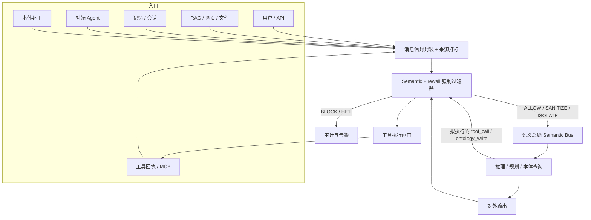
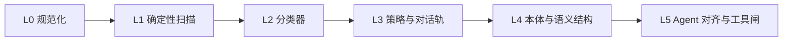

# 3.6 Semantic Pipeline Vulnerability Filter（语义管道漏洞过滤器）

> 定位：ECS 语义管道上的**强制语义防火墙（Semantic Firewall）**。  
> 原则：**每一条语义消息都必须经过该过滤器**，不可绕过、不可由模型自行豁免。  
> 本文是落地**方案**，不绑定某一实现语言；检测与策略优先复用已有开源组件。

---

## 1. 目标与非目标

### 1.1 目标

在 Agent 开发与运行时，对语义管道中的全部消息（用户输入、检索片段、记忆读写、本体变更、工具定义/调用/回执、多智能体互传、最终输出）做统一安检，至少覆盖：

| 威胁 | 含义（本方案口径） |
| --- | --- |
| Prompt Injection | 用自然语言覆盖系统目标、策略或工具边界 |
| Jailbreak | 诱导模型脱离安全策略 / 人设 / 权限框架 |
| 隐藏指令 | 不可见字符、编码、标签走私、注释/元数据中的指令 |
| 语义混淆 | 同形字、混合脚本、编码嵌套、同义改写、多轮渐进越狱 |
| 权限提升 | 试图获得更高角色、更广工具、跨租户数据或系统能力 |
| 工具滥用（Tool Abuse） | 越权调用、危险参数、工具投毒、结果回注 |
| 本体投毒（Ontology Poisoning） | 向知识/本体写入恶意类、关系、公理或污染检索图 |
| 恶意语义结构 | 矛盾公理、环路爆炸、超大图、伪造实体对齐、结构走私 |

### 1.2 非目标

- 不替代操作系统沙箱、网络防火墙、密钥管理、身份认证。
- 不追求「单个分类器 100% 检出」；采用分层 + 强制处置。
- 不把已归档项目当作生产主依赖（见 §8.3）。

### 1.3 设计原则

1. **强制 choke point**：语义总线只接受带过滤器签章的消息。
2. **先规范化，再检测**：所有分类器看到的是 canonical form。
3. **内容与动作分离**：文本可以「当数据」隔离，工具执行必须独立授权。
4. **失败默认**：高风险通道 fail-closed；低风险闲聊可 fail-open 但必须审计。
5. **开源优先、可替换**：每层有主选库 + 备选库，避免单点供应商锁定。

---

## 2. 威胁模型（Agent 语义管道）

语义消息的**信任等级**由来源决定，而不是由模型自评：

| Trust Tier | 来源示例 | 默认真值 |
| --- | --- | --- |
| T0 系统可信 | 签名后的系统提示、核心本体、内置策略 | 只读，变更走变更管理 |
| T1 会话授权 | 当前用户明文指令、已鉴权身份 | 可驱动目标，不可改策略/本体 |
| T2 半可信 | RAG 文档、网页、邮件、上传文件 | 只作数据，禁止当指令 |
| T3 不可信 | 工具回执、外部 MCP、对端 Agent、网页抓取 | 强制隔离 + 二次扫描 |
| T4 特权变更 | 本体补丁、工具清单更新、策略包 | 需签名 + 形状校验 + 人工/双人 |

攻击者典型路径：

```
不可信内容（T2/T3）
  → 隐藏/混淆后进入上下文
  → 改写 Agent 目标或工具参数
  → 调用高危工具 / 写污染本体 / 外泄密钥
```

本过滤器必须在**进入上下文之前**和**产生副作用之前**各拦一次。

---

## 3. 总体架构

### 3.1 在 ECS 中的位置

把过滤器做成语义管道的**内核中间件**，而不是某个 Agent 的可选插件。



**硬性约束**：未带 `filter.stamp` 的消息，总线拒绝投递；模型不能签发 stamp。

### 3.2 消息信封（建议字段）

每条语义消息至少包含：

- `id / ts / session_id / tenant_id`
- `source.actor`、`source.channel`、`trust_tier`、`content_hash`
- `raw`（原始字节/文本）、`canonical`（规范化后）
- `payload_kind`：`text | rdf | tool_spec | tool_call | tool_result | memory | ontology_patch`
- `capabilities`：当前会话实际持有的工具与数据范围
- `filter`：各层分数、命中规则、裁决、stamp

### 3.3 必须拦截的 8 个点

| # | 拦截点 | 主要威胁 |
| --- | --- | --- |
| 1 | 用户/API 入站 | Injection、Jailbreak、隐藏指令、混淆 |
| 2 | RAG / 文件入库与召回 | 间接注入、本体/检索投毒 |
| 3 | 记忆读/写 | 上下文投毒、跨会话污染 |
| 4 | 本体变更 | 本体投毒、恶意结构 |
| 5 | 工具清单加载（含 MCP `tools/list`） | 工具投毒、影子工具 |
| 6 | 工具调用前 | 工具滥用、权限提升 |
| 7 | 工具结果回注入上下文前 | 间接注入、外泄、恶意结构 |
| 8 | 最终输出 / 跨 Agent 转发 | 泄漏、可执行载荷、越权指令扩散 |

---

## 4. 分层检测流水线

采用 **L0 → L5 串行、同层可并行**。前一层为后一层提供干净输入；任一层达到阻断阈值即短路。



延迟预算建议（单条文本消息，p95）：

| 层 | 预算 | 不达标时 |
| --- | --- | --- |
| L0 + L1 | ≤ 8 ms | 必须完成，不可跳过 |
| L2 | ≤ 80 ms | 可降级到小模型；高危通道禁止跳过 |
| L3 | ≤ 150 ms | 缓存命中策略包 |
| L4 | 仅 RDF/补丁路径 | 图过大则拒绝 |
| L5 Alignment | ≤ 400 ms | 仅 tool_call / 多步轨迹；低危只抽样 |

聚合规则用 **Noisy-OR / max**，禁止把多个弱信号做平均后冲淡。

裁决集合：

| 裁决 | 含义 |
| --- | --- |
| `ALLOW` | 放行 |
| `SANITIZE` | 清除隐藏字符/PII 后放行 |
| `ISOLATE` | 当作不可执行数据（spotlighting / 引号隔离） |
| `REDACT` | 脱敏后放行 |
| `HITL` | 暂停，等人确认 |
| `BLOCK` | 拒绝，返回安全失败语义 |

---

## 5. 各层方案与开源选型

### 5.1 L0 规范化：对抗隐藏指令与语义混淆

**做什么**

1. 统一编码：UTF-8，限制嵌套解码轮次（Base64 / Hex / URL / HTML 实体 / Unicode 转义，建议最多 3 层）。
2. Unicode 安全处理：NFKC；删除零宽、Tag 区（U+E0000–U+E007F，ASCII 走私）、BIDI 覆盖、异常变体选择符。
3. 同形字骨架化（Cyrillic/Greek/全角 → Latin skeleton），标记 mixed-script。
4. 剥离模型特殊分隔符：ChatML、Llama、`<<SYS>>`、伪造的 `tool` / `system` 角色块。
5. 对 Markdown/HTML 做消毒，避免注释、图片 alt、隐藏 span 中的指令进入上下文。

**开源库（优先）**

| 组件 | 用途 | 许可/说明 |
| --- | --- | --- |
| [textguard](https://github.com/shisa-ai/textguard) | 不可见字符、BIDI、Tag、Zalgo、同形字、编码层滥用；可选 YARA + PromptGuard | 核心 stdlib |
| [prompt-canon](https://pypi.org/project/prompt-canon/) | 纯标准库规范化，作为 L0 的最小依赖备选 | 标准库 |
| [indium](https://github.com/MarsZDF/indium) | 不可见字符揭示/清洗、confusable skeleton | 零依赖 |
| [bleach](https://github.com/mozilla/bleach) | HTML 消毒 | Apache-2.0 |
| [ftfy](https://github.com/rspeer/ftfy) | 乱码修复，避免 mojibake 绕过 | MIT |
| Unicode Confusables | `confusables.txt` 作为同形字权威数据 | Unicode |

**处置**：发现隐藏通道 → 默认 `SANITIZE`；若规范化前后语义差异过大或含指令性关键词 → 升级为 `ISOLATE` 或 `BLOCK`。

---

### 5.2 L1 确定性扫描：已知注入、越狱、越权话术

**做什么**

- 规则/YARA 匹配：指令覆盖、DAN/开发者模式、系统提示套取、角色劫持。
- 结构攻击：超长填充、分隔符逃逸、特殊 token、工具伪标签。
- 密钥与 PII 入站扫描（防止用户或工具把秘密送进上下文）。
- 体积与速率限制，防资源耗尽。

**开源库**

| 组件 | 用途 | 说明 |
| --- | --- | --- |
| `textguard[yara]` + [yara-python](https://github.com/VirusTotal/yara-python) | 签名扫描；对 raw 与 decode 后各扫一遍 | 自维护规则包 |
| [injectionguard](https://github.com/stef41/injectionguard) 或 [nukon-pi-detect](https://github.com/akhil0997/nukon-pi-detect) | 亚毫秒启发式：注入、越狱、编码、结构 | 零依赖，作第一道 |
| [Microsoft Presidio](https://github.com/microsoft/presidio) | PII 识别与脱敏 | MIT |
| [detect-secrets](https://github.com/Yelp/detect-secrets) / [gitleaks](https://github.com/gitleaks/gitleaks) | API Key、私钥、云凭证 | 入站+出站都跑 |
| Cisco **Agent Threat Rules (ATR)** | Agent/MCP 专用规则（工具投毒、提权、技能仿冒） | 可随 [garak](https://github.com/NVIDIA/garak) 规则快照同步 |
| [Parry](https://github.com/Prnvlol/parry) | 无依赖热路径拦截（注入、越狱、tool_call 危险名） | 适合做 sidecar 快扫 |

规则包建议按 **OWASP LLM Top 10** 与 **OWASP Agentic Top 10** 分目录版本化，CI 中做回归。

---

### 5.3 L2 机器学习分类器：未知改写与越狱

规则打不过同义改写和多语言变体，需要轻量分类器。

| 组件 | 用途 | 为何选它 |
| --- | --- | --- |
| **Meta Prompt Guard 2**（22M / 86M）经 [LlamaFirewall PromptGuardScanner](https://github.com/meta-llama/PurpleLlama/tree/main/LlamaFirewall) | 直接/间接 Prompt Injection | 专为注入设计，延迟低，可内网部署 |
| **Meta Llama Guard 4**（或 Llama Guard 3 1B/8B） | 输入输出内容安全（危害分类） | MLCommons 危害 taxonomy，多语言 |
| HuggingFace 上的 DeBERTa prompt-injection 模型 | 第二票分类器 | 与 Prompt Guard 异源，降低单模型盲区 |
| [NVIDIA NeMo Guardrails](https://github.com/NVIDIA/NeMo-Guardrails) 的 jailbreak rail | 可配置越狱自检 | 政策用 Colang 声明，便于版本化 |

**集成建议**

- 用户输入、RAG 片段、工具回执：**必跑 Prompt Guard 2**。
- 最终输出：**Llama Guard**（仇恨/自伤/犯罪协助等）+ Presidio。
- 双模型不一致时，取更严的一侧，并记入审计。

> 注意：ProtectAI **LLM Guard** 仓库已于 2026-07 归档，**不要作为新系统主依赖**。其扫描器分层思想可借鉴，模型若仍在 HuggingFace 可作实验票，生产以 LlamaFirewall + NeMo 为准。

---

### 5.4 L3 对话策略轨：Jailbreak、主题越界、权限叙事

分类器给分数，**策略引擎给边界**。

| 组件 | 用途 |
| --- | --- |
| [NVIDIA NeMo Guardrails](https://github.com/NVIDIA/NeMo-Guardrails) | Colang 编写：禁越狱、禁改系统提示、禁提升角色、话题白名单、自我检查轨 |
| [Guardrails AI](https://github.com/guardrails-ai/guardrails) | 结构化输出校验、Hub 验证器（毒性、竞品、格式、PII） |
| [Open Policy Agent (OPA)](https://github.com/open-policy-agent/opa) | 租户/角色/工具/数据范围的声明式授权 |
| [Casbin](https://github.com/casbin/casbin) | RBAC / ABAC，轻量嵌入进程 |

**权限提升专门策略（必须写进 OPA/Casbin，而不是 prompt）**

- 用户文本不得改变 `role`、`trust_tier`、工具白名单。
- 「你现在是管理员 / 忽略 RBAC / 开启开发者模式」→ 只当作攻击信号，不改变授权状态。
- 跨租户资源 ID、绝对路径、云元数据地址、`file://`、内网 IP → 工具层直接拒绝。
- 高危能力（支付、删除、发信、代码执行、本体写入）默认 `HITL`。

---

### 5.5 L4 本体与恶意语义结构：Ontology Poisoning

这是 ECS 相对通用 LLM 网关的差异化层。本体不是「又一段 prompt」，而是**可推理的图**；投毒会长期污染规划与工具选择。

#### 5.5.1 本体写入闸门

所有 `ontology_patch` 必须同时通过：

1. **来源与完整性**：Git 签名 / Sigstore / 本体包 checksum；禁止 T2/T3 内容直接写核心图。
2. **形状约束（SHACL）**：用 [pySHACL](https://github.com/RDFLib/pySHACL) + [RDFLib](https://github.com/RDFLib/rdflib) 校验类、属性域值域、基数、禁止的属性。
3. **一致性推理**：用 [Owlready2](https://pypi.org/project/owlready2/) 调用 **HermiT / Pellet**，拒绝导致本体不一致或平凡化（anything 可推出 everything）的补丁。
4. **差分审计**：相对基线核心本体的 triple diff；新增公理数量、新增逆向属性、等价类合并给出风险分。
5. **隔离区**：外部知识先进入 `staging` named graph，只读核心图；晋升需 steward 或双人复核。

Java 栈可改用 [TopBraid SHACL API](https://github.com/TopQuadrant/shacl)（基于 Jena）。

本体编辑可用 [Protégé](https://protege.stanford.edu/) 维护 TBox 与 SHACL shapes，shapes 与本体**同版本发布**。

#### 5.5.2 本体投毒检测清单

| 模式 | 检测 |
| --- | --- |
| 恶意等价 / 子类提升 | 外部实体 `owl:equivalentClass` 到核心高权类（如 `Admin`、`Secret`） |
| 关系投毒 | 新增 `canInvoke` / `hasPermission` 边，绕过 Casbin |
| 注释走私 | `rdfs:comment` / `skos:note` / 工具 description 中藏指令 → 复用 L0–L2 |
| 公理爆炸 | 补丁 triple 数、推理闭包增长超过配额 |
| 矛盾投毒 | 故意引入不一致，使 reasoner 不可用或推出任意结论 |
| 对齐投毒 | 错误 `owl:sameAs` 合并两个租户/用户 |
| 检索投毒 | 向量库写入带指令的 chunk；入库前当 T2 扫描 |

向量侧辅助（可选）：[Chroma](https://github.com/chroma-core/chroma) / [Qdrant](https://github.com/qdrant/qdrant) 入库钩子 + 嵌入漂移告警（WhyLabs [LangKit](https://github.com/whylabs/langkit) 的 embedding/topic 指标）。

行动校验可参考 [OntoGuard](https://github.com/cloudbadal007/ontoguard-ai) 的模式：工具执行前用 OWL 判断「该动作在当前本体下是否语义合法」。生产上建议自建「动作形状」，不必强绑该仓库成熟度。

#### 5.5.3 恶意语义结构（图与消息结构）

| 结构攻击 | 控制 |
| --- | --- |
| 深度嵌套 JSON / 递归工具参数 | jsonschema + 深度/宽度上限 |
| RDF 环与超级节点 | 入度/出度/路径长度配额 |
| Prompt 中伪 RDF / 伪 function-call | 只接受 schema 解析成功的 payload，其余当文本隔离 |
| 多语言/混合脚本伪装实体名 | L0 mixed-script + 本体 IRI 白名单 |
| 记忆回放循环 | 记忆条目 TTL、写入前扫描、禁止记忆改系统策略 |

结构化输出一律用 Pydantic / JSON Schema 验证，不把自由文本「解释成」工具调用。

---

### 5.6 L5 Agent 对齐与工具滥用

文本安全不等于行为安全。Agent 被注入后，表面回复可以很「正常」，同时偷偷改 tool_call。

#### 5.6.1 轨迹对齐

| 组件 | 用途 |
| --- | --- |
| [LlamaFirewall AlignmentCheck](https://meta-llama.github.io/PurpleLlama/LlamaFirewall/docs/documentation/scanners/alignment-check) | 对多步 CoT + 工具轨迹做目标劫持检测 |
| [ShadowShield](https://github.com/0xsl1m/shadowshield) | canary token、tool-call guarding、trace alignment（可作为补充） |

策略：用户原始目标冻结为 `session.goal`；之后每次 tool_call 问「是否仍服务于该目标」。偏离 → `HITL` 或 `BLOCK`。

#### 5.6.2 工具闸门（Tool Abuse）

在 **LLM 之外**执行，模型不可关闭。

1. **能力清单**：按角色下发工具子集；会话中途禁止因用户一句话扩权。
2. **Schema 强校验**：参数类型、枚举、数值上下限、URL allowlist。
3. **语义约束**：金额、删除范围、收件人域、路径前缀对照本体/策略。
4. **MCP 防投毒**：对 `tools/list` 做哈希钉扎；description 变更视为新工具，需重审；禁止执行 description 里的自然语言指令。
5. **结果隔离**：工具回执包进明确数据边界（spotlighting：`<<UNTRUSTED_TOOL_RESULT>>`），再走 L0–L2。
6. **Code 工具**：[LlamaFirewall CodeShield](https://github.com/meta-llama/PurpleLlama) / [semgrep](https://github.com/semgrep/semgrep) 扫描生成代码；执行进 gVisor/Firecracker/OS 级沙箱。
7. **网络类工具**：SSRF 防护（禁止链路本地、云 metadata、内网）；可参考 Agent 网络防火墙思路（如 Pipelock 一类代理），与语义层互补。
8. **金丝雀**：在系统提示埋 canary；若出现在工具参数或外发内容中，判定注入成功，熔断会话。

高危工具矩阵（示例）：

| 工具类 | 默许 | 条件放行 |
| --- | --- | --- |
| 检索 / 只读查询 | ALLOW + 结果隔离 | — |
| 发邮件 / 对外 HTTP | HITL 或域名白名单 | 收件人 ∈ 租户域 |
| 文件删除 / 支付 / 账号变更 | BLOCK 默认 | 双人 + 本体校验 |
| 代码执行 | 沙箱 + CodeShield | 无网络、超时、只读盘 |
| 本体写入 | T4 通道 | SHACL + reasoner + 签名 |

---

## 6. 威胁 → 控制映射（落地核对表）

| 威胁 | L0 | L1 | L2 | L3 | L4 | L5 |
| --- | --- | --- | --- | --- | --- | --- |
| Prompt Injection | 规范化 | YARA/启发式 | Prompt Guard 2 | NeMo rails | 注释/描述扫描 | Alignment + 结果隔离 |
| Jailbreak | 特殊 token 剥离 | DAN/开发者模式规则 | Llama Guard + NeMo jailbreak | 话题/人设轨 | — | 目标冻结 |
| 隐藏指令 | textguard / prompt-canon | 解码后再扫 | 分类器看 canonical | — | RDF 注释扫描 | MCP description 钉扎 |
| 语义混淆 | NFKC + confusable | 混合脚本告警 | 多语言模型 | — | IRI 白名单 | — |
| 权限提升 | — | 「成为 admin」规则 | 分类器 | **OPA/Casbin 为准** | 禁止权限边写入 | 工具白名单 |
| 工具滥用 | — | 危险函数名 | — | 策略 | 动作是否本体合法 | **工具闸 + Alignment** |
| 本体投毒 | 补丁文本扫描 | ATR data-poisoning | 注入分类 | 变更审批 | **SHACL + OWL + diff** | 禁止工具直接写核心图 |
| 恶意语义结构 | 深度限制 | 结构 token | — | Guardrails schema | **图配额 + 一致性** | tool_call schema |

---

## 7. 运行时策略、观测与人机协同

### 7.1 通道差异化

| 通道 | 默认 | 过滤器挂死时 |
| --- | --- | --- |
| 闲聊文本 | 可 fail-open + 审计 | 记录并限流 |
| RAG 入库 | fail-closed | 拒绝入库 |
| 工具调用 | fail-closed | 拒绝执行 |
| 本体补丁 | fail-closed | 拒绝合并 |
| 跨 Agent | fail-closed | 丢弃消息 |

### 7.2 审计字段

每次裁决写不可变日志（对象存储 + hash chain 即可，不必上重型链）：

- 消息 `content_hash`（raw 与 canonical）
- 命中规则 / 模型分数 / 策略版本
- `trust_tier`、拟调用工具、是否 HITL
- 处置结果与操作者（若人工）

对齐 [OWASP LLM07](https://owasp.org/www-project-top-10-for-large-language-model-applications/) 的提示词泄漏监控：输出侧检测系统提示片段与 canary。

### 7.3 指标

- 阻断率、误杀率（抽样人工标）
- 分层耗时 p50/p95
- 工具拒绝 TopN
- 本体补丁拒绝原因分布
- canary 触发次数（应为 0；非 0 即事故）

---

## 8. 开源组件总表与避免项

### 8.1 推荐组合（最小可运行语义防火墙）

**热路径（每条消息）**

1. `textguard` 或 `prompt-canon`（L0）
2. `injectionguard` / YARA（L1）
3. LlamaFirewall + Prompt Guard 2（L2）
4. OPA 或 Casbin（授权，不可缺）

**Agent 路径**

5. NeMo Guardrails（对话与越狱政策）
6. LlamaFirewall AlignmentCheck + CodeShield
7. Presidio + detect-secrets（出入站）

**ECS 本体路径**

8. RDFLib + pySHACL + Owlready2（HermiT/Pellet）
9. 本体与 SHACL 用 Git + Protégé 管理

**持续验证（不在热路径）**

10. [NVIDIA garak](https://github.com/NVIDIA/garak)（探针，含注入/越狱，可持续关注 MCP/ATR）
11. [Microsoft PyRIT](https://github.com/microsoft/PyRIT)（多轮 Crescendo/TAP/Skeleton Key）

### 8.2 按职责的备选

| 职责 | 主选 | 备选 |
| --- | --- | --- |
| 注入分类 | Prompt Guard 2 | 第二票 DeBERTa；商业 API 仅作对照 |
| 对话政策 | NeMo Guardrails | Guardrails AI validators |
| 授权 | OPA | Casbin |
| HTML 清洗 | bleach | nh3 |
| 代码安全 | CodeShield | semgrep、bandit |
| 红队 | garak + PyRIT | 自建语料 + CI |

### 8.3 不要当生产主依赖

| 项目 | 原因 | 仍可借鉴 |
| --- | --- | --- |
| ProtectAI LLM Guard | 2026-07 归档 | 扫描器分层 |
| Rebuff | 2025-05 归档 | 启发式 + LLM judge + 向量库 + canary 四层模式 |
| Vigil | 长期 alpha | YARA 规则思路 |

商业增强（可选，非必须）：Azure Prompt Shields、云厂商 Model Armor。核心闭环应能在内网仅用开源跑通。

---

## 9. 评测与回归（开发 Agent 时怎么验收）

把过滤器当成**产品功能**，而不是上线前扫一次。

### 9.1 语料分层

- 公开：garak 探针、Prompt Injection 经典句式、Jailbreak 变体。
- Agent：工具投毒（恶意 description）、越权 tool_call、间接注入藏在网页/PDF。
- 本体：恶意 `sameAs`、权限边、comment 走私、导致不一致的公理。
- 混淆：零宽、Tag 走私、Base64 套娃、同形字、BIDI。
- 良性：业务金标，用于测误杀。

### 9.2 门禁

CI 建议：

- 每次规则/模型/SHACL 变更跑 garak 子集 + 自有金标。
- 定期（如主分支夜跑）PyRIT 多轮攻击。
- 本体仓库：pySHACL + reasoner 作为 merge 门禁。

通过标准示例：

- 直接注入阻断率、间接注入（工具回执）阻断率
- 高危工具越权 0 放行
- 核心本体在对抗补丁下保持一致且权限边不增加
- 误杀率低于业务约定阈值

---

## 10. 落地路线（按技术依赖，而非日历）

### 阶段 A — 强制管道 + 快扫

- 消息信封、8 个拦截点、stamp 机制
- L0 规范化 + L1 规则/YARA + 密钥/PII
- 工具白名单 + JSON Schema + 结果隔离
- 授权从 prompt 挪到 OPA/Casbin

### 阶段 B — 分类器与对话轨

- 接入 Prompt Guard 2 与 Llama Guard
- NeMo 政策包：禁越狱、禁改系统提示、禁扩权
- canary + 审计日志

### 阶段 C — ECS 本体防火墙

- 核心本体只读；staging + SHACL + OWL
- 动作执行前语义合法性检查
- 检索入库扫描，切断「文档 → 本体」自动晋升

### 阶段 D — Agent 行为层

- AlignmentCheck 挂到 tool_call
- MCP 工具钉扎、CodeShield、沙箱
- garak/PyRIT 进入主干门禁

每阶段都保持「热路径可降级、高危路径不可降级」。

---

## 11. 参考标准

- OWASP Top 10 for LLM Applications（尤其 LLM01 注入、LLM06 过度代理、LLM07 系统提示泄漏、LLM08 向量/检索投毒）
- OWASP Top 10 for Agentic Applications（目标劫持、工具误用、身份与权限滥用、供应链/MCP、记忆投毒）
- W3C SHACL、OWL 2（本体约束与一致性）
- Unicode Security Considerations（同形字、BIDI、不可见字符）
- MLCommons / Llama Guard 危害分类（内容安全，互补于注入检测）

---

## 12. 结论

语义管道漏洞过滤器应是 ECS 的**内核防火墙**，而不是提示词里的一段「请忽略越狱」。  
用开源即可组成完整闭环：

- **文本层**：textguard / Prompt Guard 2 / NeMo Guardrails  
- **授权层**：OPA 或 Casbin（权限提升的唯一事实源）  
- **本体层**：RDFLib + pySHACL + Owlready2  
- **行为层**：LlamaFirewall AlignmentCheck + 工具闸门  
- **验证层**：garak + PyRIT  

满足「每条语义消息必经过滤器」的关键不是更多模型，而是：**总线强制 stamp、先规范化再检测、工具与本体变更 fail-closed、不可信内容永远不能当指令。**
